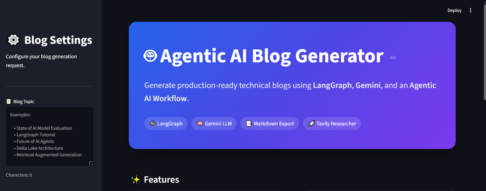
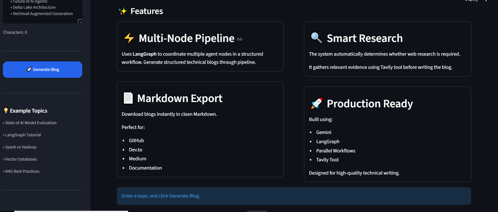
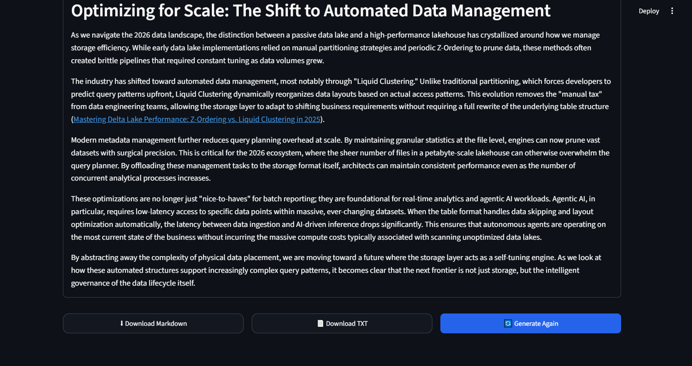

# 🤖 Agentic AI Blog Generator

<div align="center">


**An Agentic AI powered technical blog generation system built using LangGraph, Google Gemini, Tavily Search, and Streamlit.**

Generate production-ready technical blogs using an intelligent multi-agent workflow with dynamic research, structured planning, parallel content generation, and Markdown export.

</div>

---

# 📖 Overview

Agentic AI Blog Generator is an intelligent content generation system that leverages **LangGraph** to orchestrate multiple AI agents for creating high-quality technical blogs.

Unlike traditional single-prompt generators, this application dynamically decides whether external research is required, gathers evidence using **Tavily Search**, creates a structured writing plan, generates sections in parallel, and combines them into a polished Markdown blog.

The project demonstrates modern **Agentic AI architecture**, workflow orchestration, Retrieval-Augmented Generation (RAG), and multi-step reasoning.

---

# ✨ Features

- 🤖 Multi-Agent Workflow using LangGraph
- 🧠 Google Gemini LLM integration
- 🔍 Dynamic web research using Tavily Search
- 📋 Intelligent Router (Closed-book / Hybrid / Open-book)
- 📝 Automatic blog planning
- ⚡ Parallel section generation
- 📄 Markdown export
- 🎨 Interactive Streamlit dashboard
- 📊 Blog statistics (Word Count, Reading Time)
- 📖 Markdown Preview
- 📥 Download generated blogs

---

# 🏗 Architecture

```
                User Topic
                     │
                     ▼
              Router Agent
                     │
      ┌──────────────┴──────────────┐
      │                             │
Need Research?                  No Research
      │                             │
      ▼                             │
 Research Agent                     │
      │                             │
      └──────────────┬──────────────┘
                     ▼
             Planner Agent
                     │
                     ▼
          Parallel Writer Agents
                     │
                     ▼
              Reducer Agent
                     │
                     ▼
          Final Markdown Blog
```

---

# 🔄 Workflow

1. User enters a blog topic.
2. Router determines whether external research is required.
3. If needed, Tavily gathers relevant evidence.
4. Planner creates a structured blog outline.
5. Multiple writer agents generate sections in parallel.
6. Reducer combines all sections into a cohesive blog.
7. Final blog is displayed and exported as Markdown.

---

# 🛠 Tech Stack

| Category | Technology |
|----------|------------|
| Language | Python |
| Agent Framework | LangGraph |
| LLM | Google Gemini |
| Search Tool | Tavily Search API |
| Frontend | Streamlit |
| Prompt Engineering | LangChain |
| Environment | Python Virtual Environment |

---

# 📁 Project Structure

```
Agentic_AI_blog_generator/

│
├── Assets/
│
├── Blog Application/
│   ├── backend.py
│   └── frontend.py
│
├── Sample blogs/
│
├── langgraph notebooks/
│
├── .env
├── .gitignore
├── requirements.txt
└── README.md
```

---

# 🚀 Installation

Clone the repository

```bash
git clone https://github.com/Rohit2133/Agentic_AI_blog_generator.git
```

Move into the project directory

```bash
cd Agentic_AI_blog_generator
```

Create virtual environment

```bash
python -m venv agentic
```

Activate

Windows

```bash
agentic\Scripts\activate
```

Install dependencies

```bash
pip install -r requirements.txt
```

---

# 🔑 Environment Variables

Create a `.env` file.

```env
GOOGLE_API_KEY=YOUR_GEMINI_API_KEY

TAVILY_API_KEY=YOUR_TAVILY_API_KEY
```

---

# ▶ Running the Application

Start the Streamlit application.

```bash
streamlit run frontend.py
```

---

## 📸 Screenshots

### 🏠 Home Page



---

### ✨ Features



---

### 📚 Generated Blog



---

# 📌 Sample Output

Generated blogs are available in the **Sample blogs** directory.

Examples include:

- The State of AI Model Evaluation
- The State of RAG in 2026
- Demystifying Self-Attention

---

# 🎯 Future Improvements

- Live LangGraph workflow visualization
- Streaming content generation
- PDF export
- Blog history
- Multiple writing styles
- Multi-language blog generation
- Citation management
- Human feedback loop

---

# 👨‍💻 Author

**Rohit Aggarwal**

Data Engineering Intern | AI & ML Enthusiast

GitHub:
https://github.com/Rohit2133

---

# ⭐ Support

If you found this project useful, consider giving it a ⭐ on GitHub.

---

# 📄 License

This project is licensed under the MIT License.
